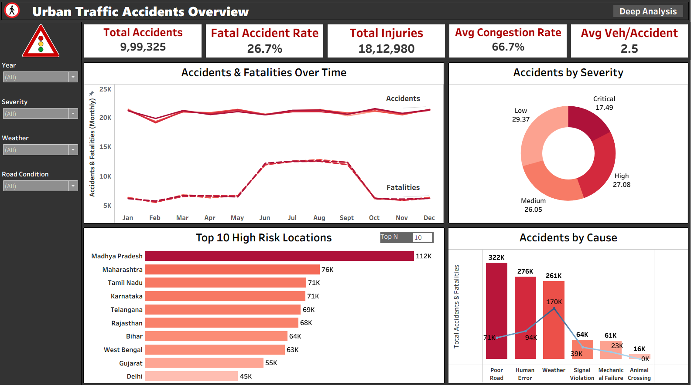
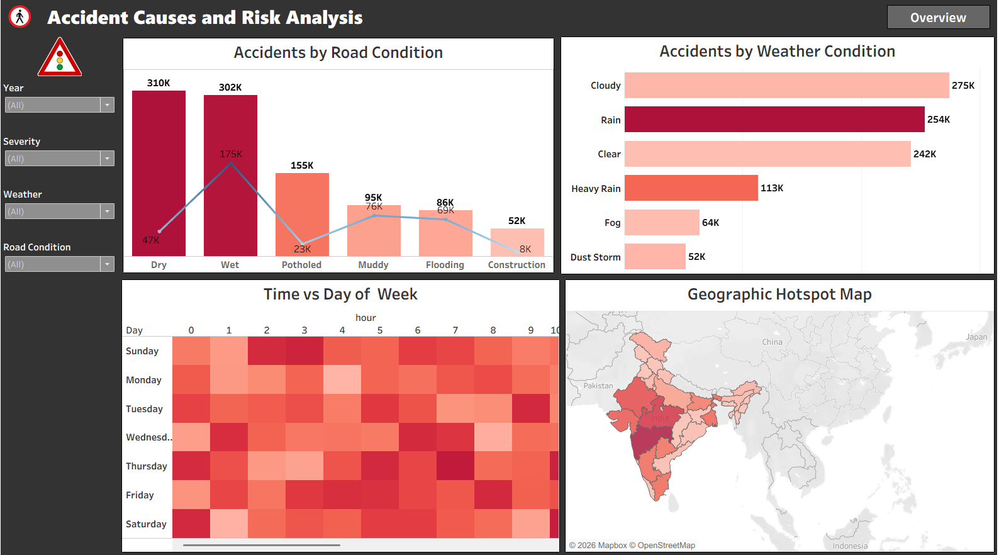

# 🚦 Urban Traffic Accidents Analysis


A comprehensive **Tableau dashboard** analyzing urban traffic accident patterns across India — covering fatality trends, geographic hotspots, causal factors, and road/weather risk analysis.

**Live Dashboard:** https://public.tableau.com/views/UrbanTrafficAccidentsAnalysis/Overview

---

## 📊 Dashboard Preview

### Overview Dashboard


### Accident Causes & Risk Analysis

---

## Key Metrics

| Metric | Value |
|---|---|
| Total Accidents | 9,99,325 |
| Fatal Accident Rate | 26.7% |
| Total Injuries | 18,12,980 |
| Avg Congestion Rate | 66.7% |
| Avg Vehicles per Accident | 2.5 |

---

## 📁 Repository Structure

```
urban-traffic-accidents-analysis/
│
├── Urban_Traffic_Accidents_Analysis.twbx   # Tableau packaged workbook
├── Urban_Traffic_Accidents_Report.docx     # Detailed project report
├── screenshots/
│   ├── dashboard1.png                      # Overview dashboard
│   └── dashboard2.png                      # Risk analysis dashboard
├── LICENSE
└── README.md
```

---

## 📌 Dashboard Pages

### 1. Overview Dashboard
- **Accidents & Fatalities Over Time** — Monthly dual-line trend (Jan–Dec); fatalities spike sharply during monsoon months (Jun–Sep)
- **Accidents by Severity** — Donut chart: Low (29.37%) | Medium (26.05%) | High (27.08%) | Critical (17.49%)
- **Top 10 High-Risk Locations** — Madhya Pradesh leads with 112K accidents, followed by Maharashtra (76K) and Tamil Nadu (71K)
- **Accidents by Cause** — Poor Road (322K) > Human Error (276K) > Weather (261K) > Signal Violation (64K)

### 2. Accident Causes & Risk Analysis
- **Accidents by Road Condition** — Dry roads (310K) and Wet roads (302K) top the list; combo bar+line chart
- **Accidents by Weather** — Cloudy (275K), Rain (254K), Clear (242K) are the top conditions
- **Time vs Day of Week Heatmap** — Identifies peak accident windows across 24 hours and 7 days
- **Geographic Hotspot Map** — State-level choropleth map highlighting central and south Indian states

---

## 🔍 Key Insights

- **Monsoon Spike** — Fatalities nearly double between June–September, aligning with the Indian monsoon season
- **Dry Road Paradox** — Dry roads have the highest accident count (310K), likely due to higher speeds and driver complacency
- **Central India Risk** — Madhya Pradesh alone accounts for ~11% of all accidents nationally
- **Human + Infrastructure** — Poor roads and human error together cause ~60% of all accidents
- **Congestion Pressure** — Average congestion rate of 66.7% signals severely stressed road infrastructure

---

## Filters & Interactivity

The dashboard supports dynamic filtering by:
- **Year** | **Severity** | **Weather** | **Road Condition**
- **Top N** — controls how many high-risk locations to display
- **Navigation buttons** — seamless switching between Overview and Deep Analysis pages

---

## 📂 Dataset

- **Source:** [Kaggle](https://www.kaggle.com/) — Urban Traffic Accidents Dataset
- **Note:** The raw dataset is not included in this repository due to file size. Please download it directly from Kaggle and connect it to the Tableau workbook.
- **Scope:** Pan-India | All years | All severity levels

---

## 🛠️ Tools & Technologies

| Tool | Purpose |
|---|---|
| Tableau Desktop | Dashboard creation & visualization |
| Mapbox / OpenStreetMap | Geographic hotspot map |
| Kaggle | Data source |

---

## 🚀 How to Open

1. Download and install [Tableau Public](https://public.tableau.com/) or Tableau Desktop
2. Clone this repository
3. Open `Urban_Traffic_Accidents_Analysis.twbx` in Tableau
4. The packaged workbook includes an extract — no separate data connection needed

---

## 📄 Project Report

A detailed project report (`Urban_Traffic_Accidents_Report.docx`) is included, covering:
- Executive summary & KPIs
- Full dashboard documentation
- Key insights & findings
- Data-driven recommendations for road safety policy

---

## 💡 Recommendations

- Deploy seasonal safety campaigns during monsoon months
- Prioritise road resurfacing in Madhya Pradesh, Maharashtra & Tamil Nadu
- Enforce speed limits on dry roads to counter complacency
- Install smart traffic monitoring at identified hotspot intersections

---

## 🙋 Author

> Feel free to connect or raise an issue if you have questions about the dashboard or data!
